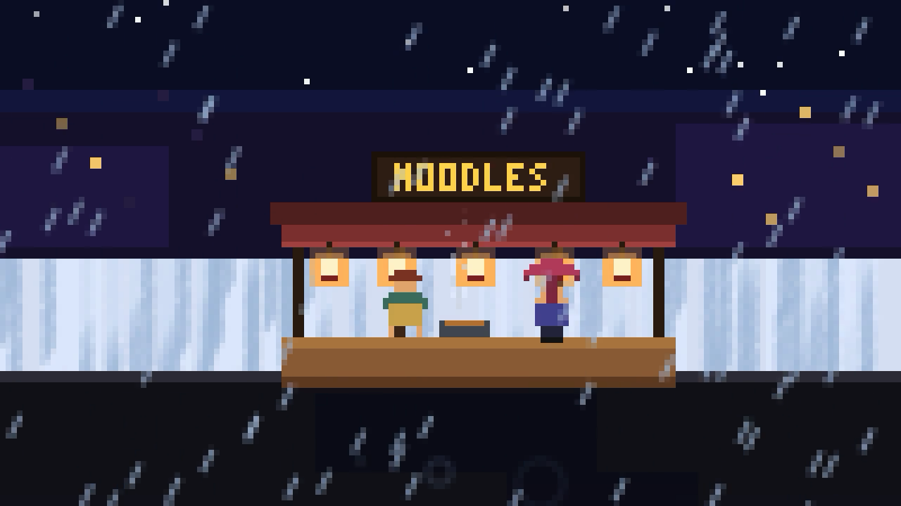
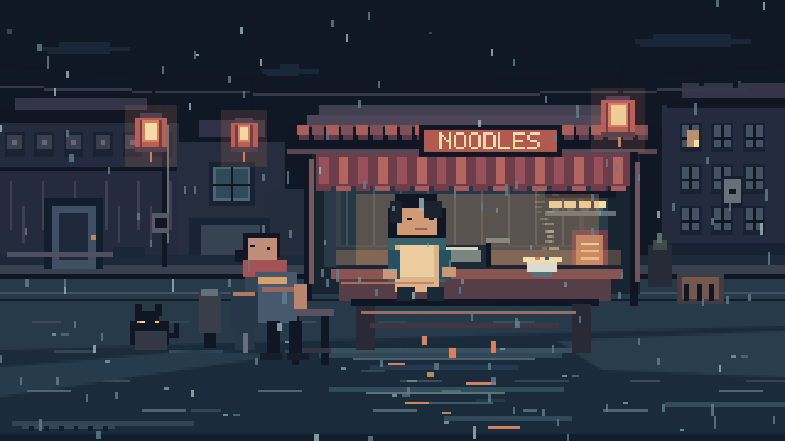
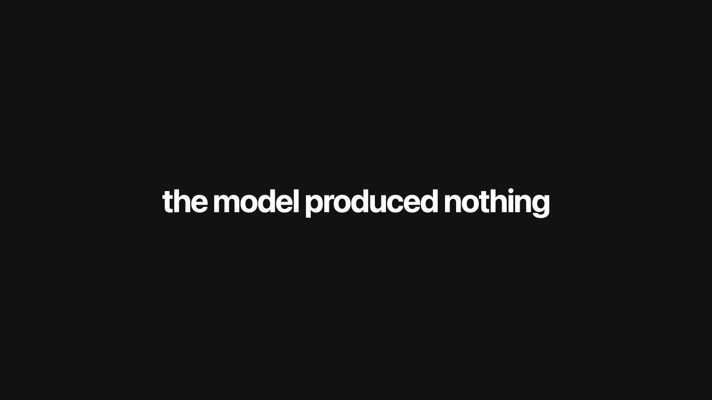

# Background recording verification, 2026-09-29

CODING-2382, parent CODING-2362. The offscreen recorder could capture a static
page while omitting an entire canvas scene drawn by `requestAnimationFrame`.
A recording-only NSWindow subclass now reports visible occlusion state so WebKit
keeps rendering while its window remains at the existing offscreen position.
The local regression, release-app recording, and QuickTime playback checks pass.
X draft playback through the app also passes with owner confirmation.
Release-app desktop visibility remains unverified.

## Revision and environment

- Base source revision: `66b6a4de351cb9039d427b395a0415d757247243`, plus this working-tree change.
- Recorder SHA-256: `5d88835ec0fd3d4e72b29792584f4278e61c727b3251b8ec89fe20d6ce179fa4`.
- Release executable SHA-256: `01930e0139648fb891c347ff988ba3f65d24b5b1369036aee92bd6194843fc12`.
- App version: 0.1.0, local release build, ad hoc signed, arm64.
- macOS: 26.2, build 25C56. Xcode: 26.1.1, build 17B100.
- Existing edits to `docs/x-handle-verification-report-2026-09-29.md` were left untouched.
- No affected owner run was supplied. These results reproduce a concrete mechanism; they do not establish whether an additional X-only issue affected the owner's videos.

## Reproduction and repair

The test host runs NSApplication's main event loop and invokes the production
synchronous Recorder on a background task. The recorder selects and loads actual
local files with `loadFileURL`, creates its normal offscreen window, captures
WebKit snapshots, and encodes them with AVAssetWriter.

1. The unchanged recorder passed the asymmetric static-page check at 1, 9, and
   17 seconds. File loading, static rendering, orientation, and encoding worked.
2. The animated fixture puts its scene inside a `requestAnimationFrame` callback.
   The unchanged recorder produced only its blue CSS background. At frame 15,
   the expected red region was RGB 32,64,192 instead of 224,48,32. Thus a valid
   movie header and successful encoder did not establish captured content.
3. Setting `inactiveSchedulingPolicy = .none` still failed at the same region.
   This experimental change was removed.
4. Replacing only the recorder's NSWindow with a subclass whose `occlusionState`
   includes `.visible` made the same test pass, including both marker states.
   The window position, source HTML, file loading, capture, conversion, encoding,
   and readiness delay remained unchanged.

This isolates the loss to offscreen animation activity before encoding. WebKit's
[visibility check](https://github.com/WebKit/WebKit/blob/main/Source/WebKit/UIProcess/mac/PageClientImplMac.mm)
consults the window's visibility and occlusion state. WebKit also documents that
[hidden pages stop requestAnimationFrame](https://webkit.org/blog/8970/how-web-content-can-affect-power-usage/).
The subclass uses the public AppKit property, scoped to the recording window;
it neither patches the page nor calls private WebKit selectors. This behavior
should be rechecked on other supported macOS/WebKit versions.

Before and after, decoded frame near one second:

## Results

| Check | Result |
| --- | --- |
| Static local page | Pass. Red, blue, green, asymmetric yellow marker, and orientation at 1/3/5/9/17 seconds; region tolerance 25 per RGB channel. |
| Animated canvas | Pass. Persistent colored regions and both black/white marker states. |
| Empty folder | Pass. Native OCR reads "the model produced nothing" at every sampled time. |
| Claude trial | Pass. Visible market, with 6,237 / 14,187 / 20,716 / 3,990 upper-scene pixels changing by more than 35 versus the first sample. |
| OpenAI trial | Pass. Visible market, with 4,967 / 9,142 / 8,893 / 11,548 upper-scene pixels changing by more than 35. |
| Consecutive inputs | Pass. Static → animated → empty → Claude → OpenAI → static in one host; each movie checked against its own content. |
| Legitimate black page | Pass. Black regions retained; no fallback substitution or runtime visual classifier. |
| Encoding metadata | Pass for every checked movie: silent H.264, 1280×720, 270 frames, 18.0 seconds; nominal frame rate 15.000001. |
| Real filesystem failure | Pass. A file used as the run directory throws `writerFailed("Cannot create file")`, leaves no movie and no visible window; a subsequent animated recording passes. |
| Window lifecycle | Pass in the integration host. No capture window intersects an attached display during recording; no window stays visible afterward. |
| Record failure orchestration | Pass. Error throws, Record notification occurs, Poster remains untouched, model stays unseen; retry succeeds and posts once. |
| Generation failure/timeout | Pass. Existing and strengthened core checks verify recording receives the run's working folder. |
| Draft only / post retry / Slop now | Existing core tests pass. Production call sites still construct the same WebViewRecorder. |
| Core suite | 85 tests in 11 suites pass. |
| Release build | Pass. `Scripts/build-app.sh` builds and signs the app. |
| Built-app automatic recording | Pass. Unmodified release binary, isolated app data, a fixture-producing test CLI, Draft only forced via launch argument, networking denied. Scheduler starts recording without clicks. Native decoder verifies that movie's colors, marker states, and metadata. |
| QuickTime playback | Pass on 2026-09-29 at approximately 21:50 IST. Opened the selected Claude demo.mp4 in QuickTime on the signed-in macOS desktop. Playback advanced from approximately 0.4 to 4.7 seconds, with visibly changing rain, lanterns, and steam. |
| X draft playback and cleanup | Pass through the app on 2026-09-29 at approximately 22:09 IST. The built-in --draft-video path attached the selected Claude movie and reached draftReady. The composer displayed the animated scene and advancing playback; the owner confirmed normal playback on screen. Subsequent automation captures sometimes appeared black and paused, so those captures are not proof of playback failure. Removed the attachment, cleared test text, and verified Post disabled. Nothing was published. |
| Release-app desktop and Mission Control | Unverified. The 21:51 IST offline release-app smoke run passed native movie inspection, but the desktop observation call took approximately 533 seconds and returned only Finder. A subsequent Mission Control request timed out. These observations do not establish visibility during recording. |

The visibility timer covers the native integration host. A visual observation of
the release app's desktop window behavior remains part of the manual smoke check.
The automated release-app run establishes unattended completion and movie content.
No historical run was regenerated or reposted.

Regression sensitivity was checked with two negative controls. The final checker
rejects the preserved pre-fix movie at the missing red region. It also rejects a
270-frame, 18-second H.264 movie made by repeating a good animated frame, reporting
`animation frozen: [true]`. FFmpeg was used only to create this test control; the
regression suite decodes with native APIs and the app gains no dependency.

Trial and fallback frames near nine seconds:

## Fixtures and rerun instructions

Fixtures are checked in under `Tests/RecorderIntegration/Fixtures`. Saved trials
were copied unchanged from
`spec/slop-factory--c7b4571a/T2208--09-pick-the-frozen-prompt-ready-for-huma/{claude,openai}-pixel-trial/index.html`.
Both copies were compared byte-for-byte with the originals.

| Fixture | SHA-256 of index.html |
| --- | --- |
| static | `781cc7d97c3cb5bbc189f44ef901030ccab88ffcf5c7cd5fab8d6e9947ef593e` |
| animated | `d62bf31ac42a1765c84e0db24b962a27e601e286e6366eec381910d44727ef69` |
| claude | `66b854d318742c77376f407dda613732e4014bade58ef262543f192fd5d02cfc` |
| openai | `44fc6fd5bf3178f64c5a6d221ed2df93b03735a9a24bd56b30ec91b8126703d4` |
| dark | `634dd7596a012b8c9d2f8021a2f032109059f5adcf98d72b08a9c492208ac9a6` |

Run `Scripts/test-recorder.sh`, `swift test --disable-sandbox`, and
`Scripts/build-app.sh`. See [test instructions](../Tests/RecorderIntegration/README.md)
for single-case inspection and the isolated release-app smoke script. Generated
movies, five PNG samples per successful case, logs, source patch, and the baseline
movie are preserved locally in `.build/CODING-2382-recording-evidence.zip`.
Automatic approval review rejected exporting that broad archive because it contains
source, logs, and fixtures. The report and selected decoded images are published
separately. Local full evidence is under `.build/recorder-evidence`; the release-app run is under
`.build/recorder-smoke/data-1790686086133266000/runs/claude-recorder-fixture-E87288FA-7596-4AE6-A59A-5A78B2F7B802`.

Earlier CODING-2389 retries were blocked by desktop access on macOS 26.2, build
25C56. At approximately 19:30, 19:42, and 19:58 IST on 2026-09-29, `cua.getState()` returned empty
app and browser inventories with `Computer Use server error -10005: codex
app-server exited before returning a response`. Direct access through
`cua.getApp('com.apple.QuickTimePlayerX')` returned the same error. An awake,
signed-in desktop and authenticated X session could not be established.

The selected fixed-recorder trial is `.build/recorder-evidence/3-claude/demo.mp4`,
SHA-256 `0170cd2f3758451acd74ab0a1a340088d815b523a29e3ebaaf87305328f55294`.
Desktop access was restored after configuring Codex to use the resolved
`/Users/REDACTED/.codex` directory. QuickTime playback now passes, as described
above, and the selected movie's SHA-256 was reconfirmed. The offline release-app
smoke rerun also passed native content inspection. Its movie is
`.build/recorder-smoke/data-1790698877996553000/runs/claude-recorder-fixture-479B0E2E-FB12-4902-9B7E-140733CF8018/demo.mp4`.

The app-flow check used release build 0.1.0 from the current working tree,
`.build/CODING-2389/Slop Factory.app`, executable SHA-256
`264a05d0ff77120005b94ad222013247e43be0c9cf9b3e22870ef11d7f8ff62e`.
Its built-in `--draft-video` command forces Draft only and uses the production
X uploader. A temporary `-repositoryURL https://github.com/charleeagni/slop-factory`
launch argument supplied the local build's missing repository configuration.
The input was the same Claude movie verified in QuickTime. The app's upload log
is preserved in [app draft upload log](recording-evidence/app-draft-post-2026-09-29.log).
It records attachment at 22:08:58 IST and `draftReady` at 22:09:07 IST.

The composer showed the scene at five seconds and again during replay at one
second. Other captures showed black video and paused controls, including one
ScreenCaptureKit error -3811. The owner explicitly confirmed that the video
played normally on their screen. This is a pass based on observed composer
content plus owner-confirmed normal playback, not Upload Ready alone. It does
not establish an X-only failure. The video attachment was removed, test text
cleared, and the empty composer showed Post disabled. Nothing was published.

Acceptance remains incomplete only for release-app desktop and Mission Control
visibility during recording. The standalone Chrome attempt is not acceptance
evidence. No speculative recorder change or X-only finding was made. The item
remains in Implement pending the last visibility check. The owner explicitly
asked to leave that check pending; no additional visibility run was started.

Status check on 2026-09-30 at approximately 14:13 IST confirmed macOS 26.2,
build 25C56, and successful Computer Use app and browser inventory access.
The selected Claude movie still matches the SHA-256 above. WorkTracker reports
no Implementation children. This inventory check does not verify release-app
visibility during recording. The owner's instruction to leave that check pending
remains in effect, so no new recording or Mission Control observation was started.
QuickTime and app-flow X playback retain their recorded passes. Acceptance remains
incomplete and the item stays in Implement.

## Built-app smoke correction, CODING-2386

The earlier smoke script checked duration with ffprobe; native content inspection
was a separate step. The smoke command now waits for `post.log`, written only
after the synchronous recorder returns and finalizes the movie. It terminates
the app, runs `Scripts/test-recorder.sh` with `inspect-animated`, and prints PASS
only if that command succeeds. Python 3 and Xcode are required; ffprobe is not.

The updated command passed against the existing fixed release app. Its movie is
`.build/recorder-smoke/data-1790688528687499000/runs/claude-recorder-fixture-39EF54A3-D81D-4199-9936-3C7CFAFB3B4A/demo.mp4`;
decoded samples are in that data folder's `inspection` directory. The native
inspector confirmed colors, changing markers, and 270 silent H.264 frames at
1280×720, 15 fps, and 18 seconds. It separately rejected the preserved pre-fix
movie with a missing red region and the frozen control with `animation frozen`.

Three Python process-boundary regression tests pass: a failing inspector prevents
PASS and propagates failure, successful inspection follows completion and app
termination, and an unfinished movie times out without inspection. The failure
test was run against the old script first and reproduced its false pass.
